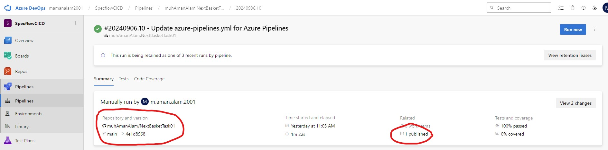
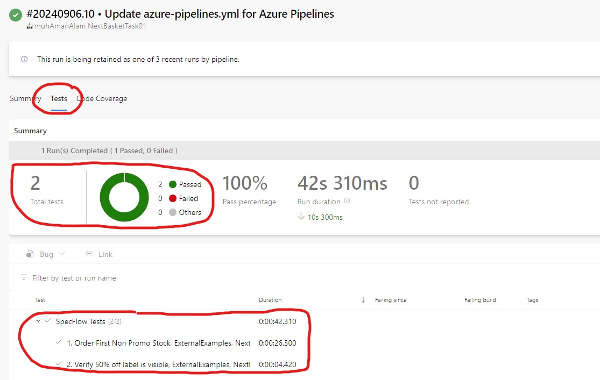
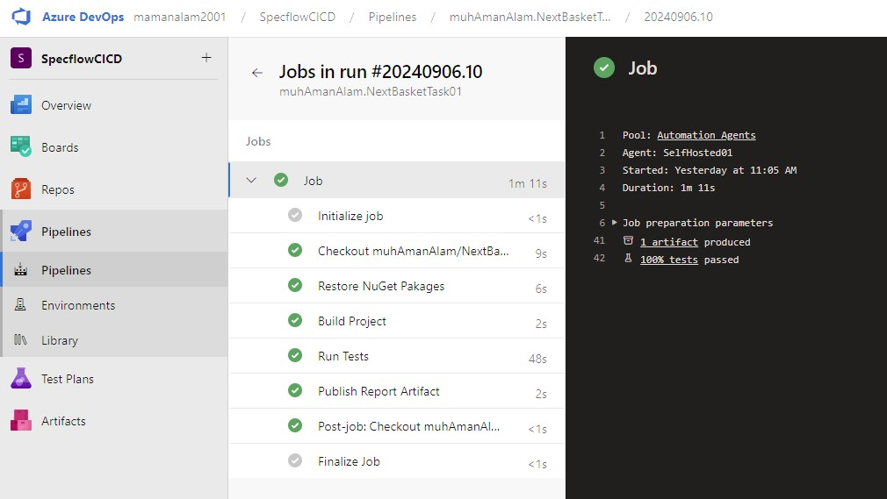
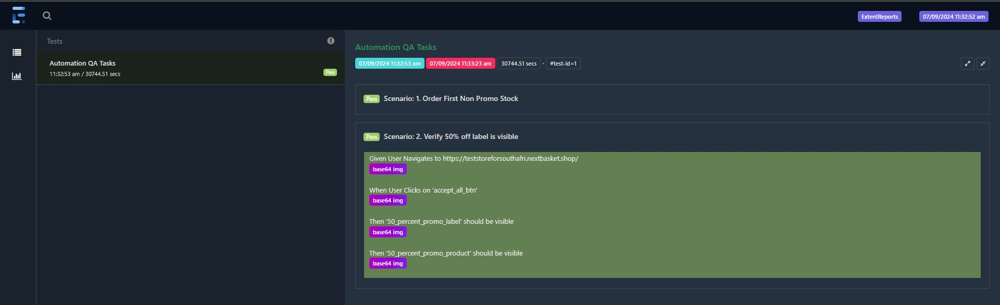

This is a Keyword-Driven C# based Web and API automation framework implementing: 
* Specflow
* Selenium WebDriver
* ExtentReports

# How to setup this solution on your machine
1. If chromedriver.exe exists in your local machine's path environmental variable, then it update according to your installed chrome version.
2. Launch Visual Studio 2022 and select 'Clone a repository', then enter the reposity URL and clone.
3. Build the solution and select run all tests in the test explorer. (If tests do not appear the first time make sure to click the run all tests button again  *this is a bug with SpecFlow)

# Additional Features
1. An Azure DevOps CI/CD Pipelne azure-pipeline.yml is also present at the root of this repository. Here are Screenshots from the Azure Devops Project this repository is connected to. (I cannot share the link to Azure Devops project as it is private by default and there is no way to make it public).

3. 1. As part of execution this framework also generates an HTML report of all the test cases which is generated at \testing\Report\TestReport.html

